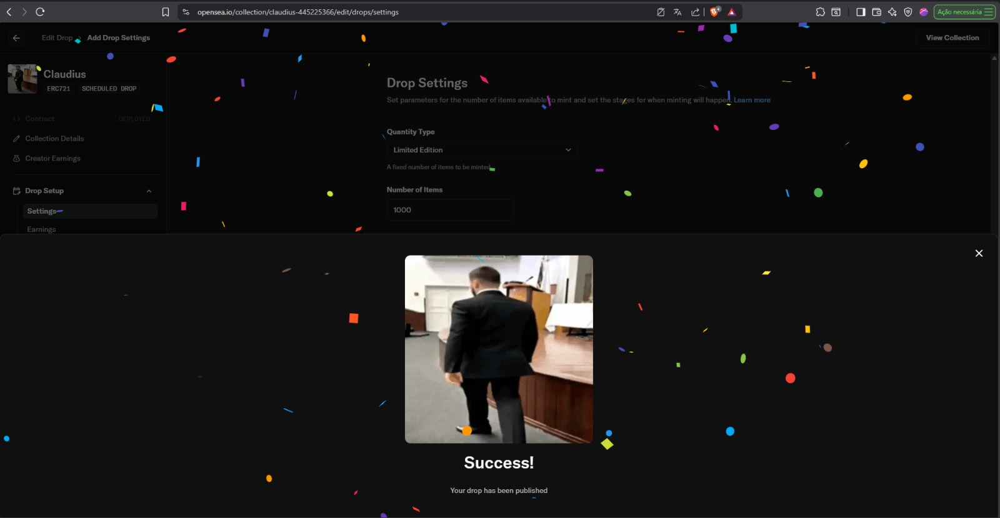
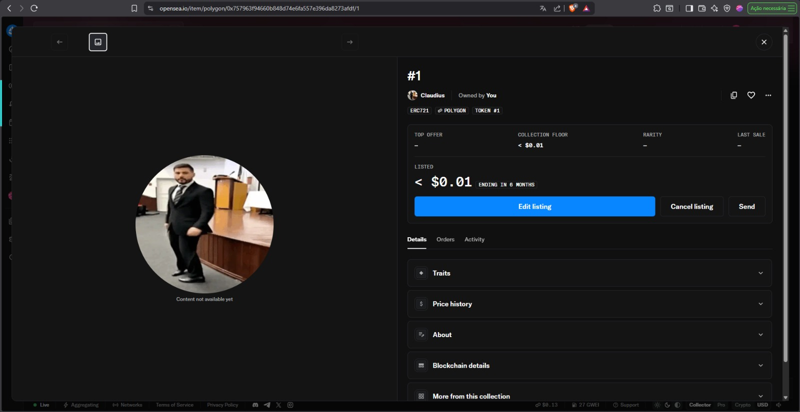
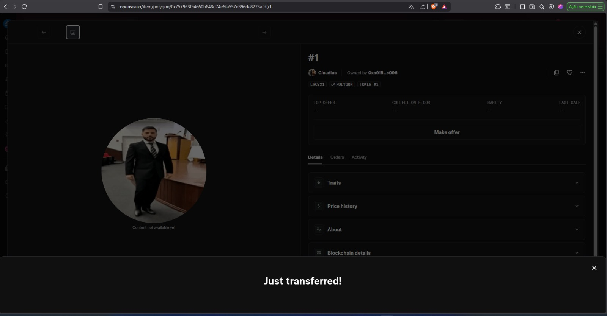
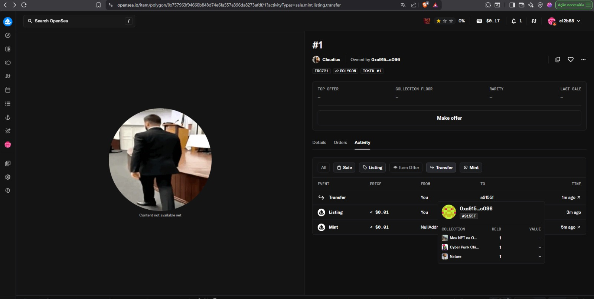

# Desafio: Criação de NFT na Blockchain Polygon (OpenSea)

Este repositório documenta a criação de um Token Não Fungível (NFT) na blockchain gratuita OpenSea Polygon, como parte do desafio do Bootcamp Blockchain Developer com Solidity 2025 da DIO.

## 📋 Descrição do Desafio

Neste desafio, foi criado um NFT na Blockchain gratuita OpenSea Polygon, seguindo todas as instruções e o passo a passo fornecido pelo Instrutor.

## 📸 Evidências do Projeto

### 1. Token NFT Criado

*Print do token NFT criado com sucesso*

### 2. NFT Listado no OpenSea

*Evidência do NFT listado na plataforma OpenSea*

### 3. Mensagem de Transferência

*Confirmação da transferência do NFT*

### 4. NFT na Carteira Destino

*NFT recebido na carteira de destino (carteira do Instrutor)*

## 🔗 Links Úteis

- [OpenSea - Polygon](https://opensea.io/)
- [Polygon Network](https://polygon.technology/)
- [Documentação OpenSea](https://docs.opensea.io/)

## 📝 Observações

- O NFT foi criado na blockchain Polygon
- A transferência foi realizada com sucesso para a carteira do Instrutor
- Todas as etapas do desafio foram concluídas conforme solicitado

